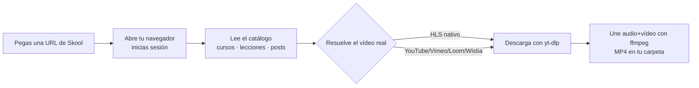

<p align="center">
  
</p>

<h1 align="center">Skool Downloader</h1>

<p align="center">
  Descarga los vídeos de tus cursos y lecciones de <b>Skool</b> a los que ya tienes acceso — en tu propio equipo, con tu sesión.
</p>

<p align="center">
  
  
  
  
  
</p>

---

## ✨ Qué hace

- 📚 **Recorre comunidades enteras**: cursos, módulos, lecciones y publicaciones, con conteo antes de descargar.
- 🎥 **Detecta el vídeo real**: HLS nativo de Skool (incluido shadow-DOM) y embeds de YouTube, Vimeo, Loom y Wistia vía `yt-dlp`.
- 🔒 **Con tu sesión, en tu equipo**: abre tu navegador, inicias sesión en Skool y la cookie se queda solo en tu máquina.
- ♻️ **Reintenta enlaces caducados**: los enlaces temporales de vídeo se vuelven a resolver solos; nada de errores crípticos de CloudFront.
- 🧩 **Honesto con lo bloqueado**: si una lección está gated por nivel, lo intenta y te dice si Skool de verdad no la entrega, sin fingir éxito.

## ⬇️ Descargas

Los ejecutables se compilan solos en Windows, macOS y Linux con GitHub Actions y quedan en el último [**Release**](https://github.com/crisbagu/skool-downloader/releases/latest).

| Sistema | Archivo | Tipo |
|---|---|---|
| 🪟 Windows | [`skool-downloader-windows.exe`](https://github.com/crisbagu/skool-downloader/releases/latest/download/skool-downloader-windows.exe) | Línea de comandos |
| 🍎 macOS | [`skool-downloader-macos`](https://github.com/crisbagu/skool-downloader/releases/latest/download/skool-downloader-macos) · [`SkoolDownloader-mac.dmg`](https://github.com/crisbagu/skool-downloader/releases/latest) | CLI · App con ventana |
| 🐧 Linux | [`skool-downloader-linux`](https://github.com/crisbagu/skool-downloader/releases/latest/download/skool-downloader-linux) | Línea de comandos |

> Los binarios llevan **Chromium y ffmpeg incluidos**: descargas y ejecutas, sin instalar nada más.

## 🚀 Uso rápido (CLI)

```sh
# 1) Analizar una comunidad (genera catalog.json con todo lo accesible)
skool-downloader "https://www.skool.com/tu-comunidad/classroom" --action scan --catalog catalog.json

# 2) Descargar TODO lo accesible del análisis
skool-downloader "https://www.skool.com/tu-comunidad/classroom" --action batch --catalog catalog.json --output ./descargas

# …o una sola lección:
skool-downloader "https://www.skool.com/tu-comunidad/classroom/curso?md=leccion" --quality 1080 --output ./descargas
```

Al ejecutarse se abre una ventana de navegador para que inicies sesión en Skool la primera vez.

## 🧠 Cómo funciona



## 🍎 App de macOS con ventana

Abre `build/Skool Downloader.app` (doble clic). Pega el enlace, elige calidad y carpeta, y pulsa **Descargar**.
Para reconstruirla desde el código:

```sh
python3 build.py
```

## 🛠️ Desde el código (cualquier SO)

```sh
python -m venv .venv
# Windows:  .venv\Scripts\pip install -r requirements.txt
# Mac/Linux: .venv/bin/pip install -r requirements.txt
python -m playwright install chromium
python engine.py "https://www.skool.com/tu-comunidad/classroom" --action scan --catalog catalog.json
```

Pruebas:

```sh
python -m unittest discover -s tests -v
```

## 🔐 Privacidad y límites

- Tu sesión y tus cookies de Skool **nunca salen de tu equipo** ni se suben al repositorio (`.gitignore` excluye `catalog.json`, el perfil `browser/`, los vídeos y los artefactos de build).
- Los mensajes de error se **filtran** (`redact`) para no mostrar URLs firmadas ni tokens temporales.
- Requiere tu **acceso legítimo** al contenido. No elimina DRM ni desbloquea cursos a los que tu cuenta no tenga derecho.

## 📄 Licencia

MIT — ver [`LICENSE`](LICENSE).
